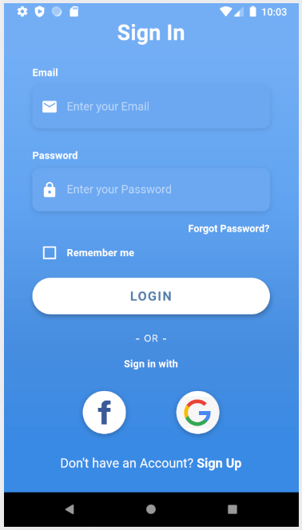
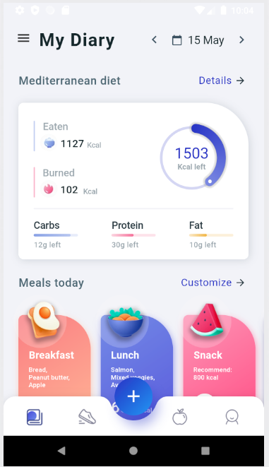
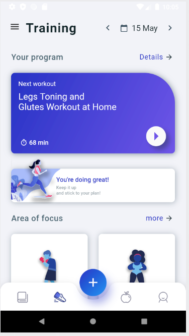
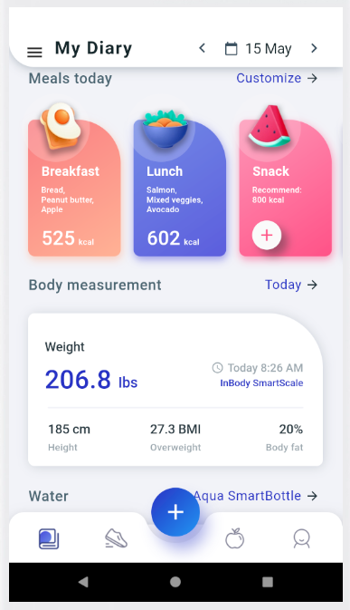
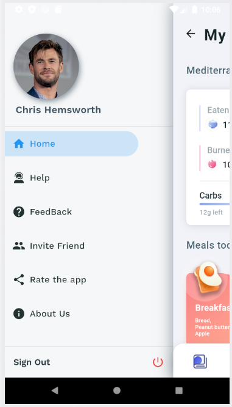
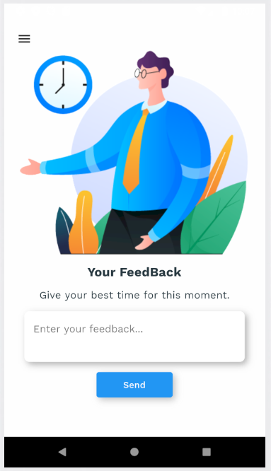
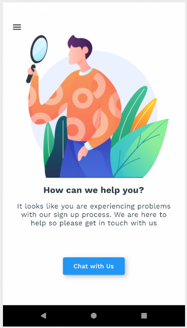
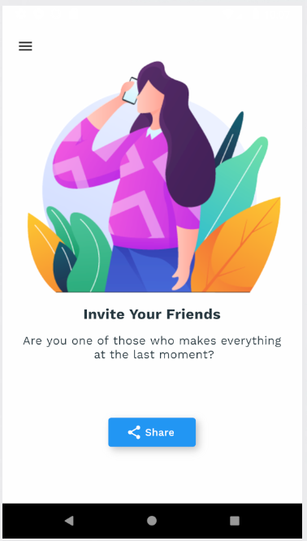

# Fitness App

A new Flutter application.

## Getting Started

This project is a starting point for a Flutter application.

A few resources to get you started if this is your first Flutter project:

- [Lab: Write your first Flutter app](https://flutter.dev/docs/get-started/codelab)
- [Cookbook: Useful Flutter samples](https://flutter.dev/docs/cookbook)

For help getting started with Flutter, view our
[online documentation](https://flutter.dev/docs), which offers tutorials,
samples, guidance on mobile development, and a full API reference.

About this App:
- This is an App for Nutrients and Training Process
- Using official data from professions for recommending about the training and nutrients everydays
- UI/UX easy to use
- Having behavioral monitoring for couting steps from users
- Comfortability for login and access from Google or Facebook
- This App will be soon update for new version with many new functions and optimization

Some Pictures about this app:

Login Screen:

Home Screen:

Training Screen:

My Diary Screen:

Drawer Screen:

FeedBack Screen:

Help Screen:

Invite Friends Screen:

